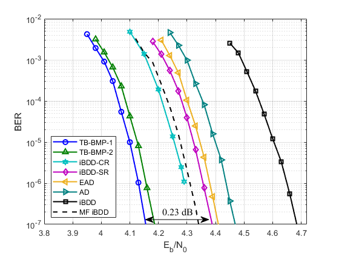
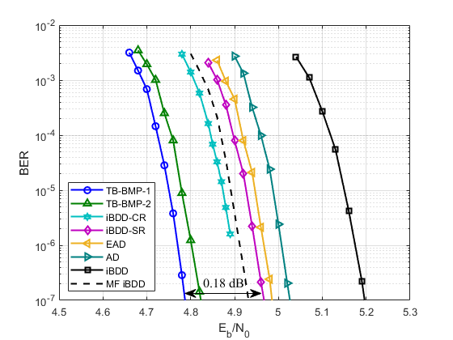
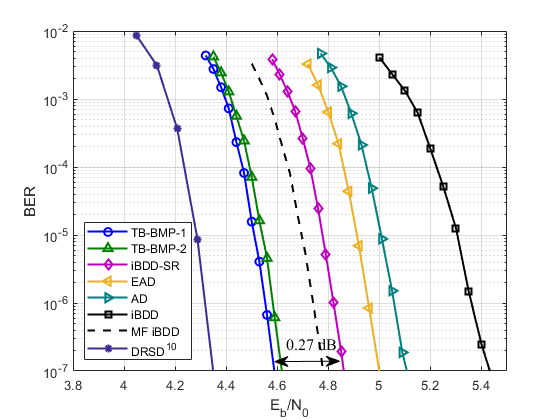
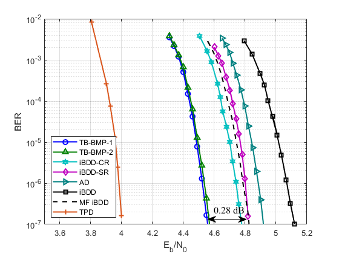

# Parameters of TB-BMP
Parameters of the threshold-based binary message passing (TB-BMP) decoder with memory for product codes (PCs) with different component BCH codes are now available!

## What is TB-BMP
The TB-BMP is a modification of [iBDD-SR](https://ieeexplore.ieee.org/abstract/document/8832202) by introducing a **memory unit** and a **threshold**. In the proposed decoding algorithm, the soft reliability of the bounded distance decoding (BDD) output at the current half-iteration is a weighted sum of the BDD output, the channel reliability, and the content of the memory unit, where the content of the memory unit at the current half-iteration is related to the selected threshold and the BDD output at last half-iteration.

The above figure shows the block diagram of TB-BMP at half-iteration $\ell$. Here, $w^{(\ell)}$ is a scaling factor which can be obtained via density evolution (DE) of TB-BMP, $L$ is the value of log-likehood ratio (LLR), and the soft reliability $u^{(\ell)}$ is given as $$u^{(\ell)} = w^{(\ell)} \bar{u}^{(\ell)} + \beta^{(\ell-1)}w^{(\ell)}B^{(\ell-1)} + L.$$ 

### TB-BMP-1
The value of $B^{(\ell)}$ is a function of the value of $u^{(\ell)}$, the BDD output $\bar{u}^{(\ell)}$, and the flipping threshold $T$. 

- If the absolute value of the soft reliability ${u}^{(\ell)}$ is less than the threshold $T$ or the decoding declares a failure in the $\ell$-th  half-iteration, we have $B^{(\ell)}=-\mathrm{sgn}(u^{(\ell)})$; 
- otherwise, the output of the BDD is saved to the memory unit and we have $B^{(\ell)}=\bar{u}^{(\ell)}$.

This TB-BMP decoder is referred to as `TB-BMP-1`.

### TB-BMP-2
The value of $B^{(\ell)}$ is the value of $u^{(\ell)}$ and the flipping threshold $T$.

- If the absolute value of the soft reliability ${u}^{(\ell)}$ is less than the threshold $T$, we have $B^{(\ell)}=-\mathrm{sgn}(u^{(\ell)})$; 
- otherwise, the output of the BDD is saved to the memory unit and we have $B^{(\ell)}=\mathrm{sgn}(u^{(\ell)})$.

This TB-BMP decoder is referred to as `TB-BMP-2`.

## Parameters $w^{(\ell)}$ and $\beta^{(\ell)}$
The values of parameters $w^{(\ell)}$ and $\beta^{(\ell)}$ for both TB-BMP-1 and TB-BMP-2 are obtained based on `the DE of TB-BMP-2 with extrinsic BDD`. In the following, extrinsic message passing and intrinsic message passing are abbreviated as EMP and IMP, respectively.

### The calculation of $w^{(\ell)}$ 
Let $x^{(\ell)}$ denotes the average error probability of the TB-BMP-2 output at half-iteration $\ell$. The scaling factor $w^{(\ell)}$ based on the analytical results of the DE is given as
$$w^{(\ell)} = \log \Bigl(\frac{ f^c(x^{(\ell-1)},p_{\mathrm{ch}}) }{ f^e(x^{(\ell-1)},p_{\mathrm{ch}}) } \Bigr),$$
where
$$f^c(x,p_{\mathrm{ch}}) = \sum_{j=0}^{n-1} \binom{n-1}{j} (x)^{j} (1-x)^{n-j-1} \times \Bigl( p_{\mathrm{ch}}P^c(j) + (1-p_{\mathrm{ch}})Q^c(j) \Bigr) $$
and
$$f^e(x,p_{\mathrm{ch}}) = \sum_{j=0}^{n-1} \binom{n-1}{j} (x)^{j} (1-x)^{n-j-1} \times \Bigl( p_{\mathrm{ch}}P^e(j) + (1-p_{\mathrm{ch}})Q^e(j) \Bigr).$$
Here, $P_{\mathrm{ch}}$ is the error probability of the channel ouput and $P^c(j)$, $Q^c(j)$, $P^e(j)$, and $Q^e(j)$ can be found in the [paper](https://ieeexplore.ieee.org/abstract/document/8832202) of iBDD-SR.

### The calculation of $\beta^{(\ell)}$
We impose the constraint that $0 \leq \beta^{(\ell)} < 1$. Particularly, for a fixed $T$, the parameter $\beta^{(\ell)}$ is given as
$$\beta^{(\ell)} = \frac{P( -T < u^{(\ell)} < 0 )}{ P( u^{(\ell)} < T ) }.$$
The values of $\beta^{(\ell)}$ are obtained during the process of DE.

### Parameters of $w^{(\ell)}$ and $\beta^{(\ell)}$ for different PCs
In the following simulations, the parameters $w^{(\ell)}$ and $\beta^{(\ell)}$ for both TB-BMP-1 and TB-BMP-2 are selected via the DE of TB-BMP-2. Furthermore, both TB-BMP-1 and TB-BMP-2 are executed for the first 10 iterations and iBDD are then executed for the last 2 iterations. These parameters are obtained by **setting the target BER $=10^{-7}$** after 20 half-iterations for DE.

For IMP, the DE analysis provide a guideline to select parameters $w^{(\ell)}$ and $\beta^{(\ell)}$ according to the optimal $T_{\mathrm{IMP}}$ obtained via Monte-Carlo simulations. We only consider performances of IMP-based TB-BMP-1 with the optimal $T_{\mathrm{opt}}^{(1)}$ and IMP-based TB-BMP-2 with the optimal $T_{\mathrm{opt}}^{(2)}$, where parameters $w^{(\ell)}$ and $\beta^{(\ell)}$ are selected according to $T_{\mathrm{opt}}^{(1)}$ and $T_{\mathrm{opt}}^{(2)}$.

#### The PC with (255,231,3) BCH code
We first present the below figure the simulation results of both TB-BMP-1 and TB-BMP-2 with $T_{\mathrm{opt}}^{(1)} = T_{\mathrm{opt}}^{(2)} = 2.8$ for the PC based on (255,231,3) BCH code. 

For both $T_{\mathrm{opt}}^{(1)} = T_{\mathrm{opt}}^{(2)} = 2.8$, we have
- $w^{(0 \to 19)}=$ 3.10 3.16 3.54 3.60 3.69 3.75 3.80 3.85 3.89 3.94 4.00 4.06 4.14 4.25 4.41 4.67 5.14 6.14 8.27 12.19
- $\beta^{(0 \to 19)}=$ 0.24 0.23 0.26 0.26 0.27 0.27 0.27 0.27 0.27 0.27 0.27 0.27 0.26 0.26 0.25 0.23 0.18 0.12 0.06 0.03

For iBDD-SR, we have
- $w^{(0 \to 19)}=$ 3.09 3.15 3.54 3.59 3.68 3.72 3.77 3.81 3.85 3.90 3.95 4.01 4.08 4.17 4.31 4.52 4.90 5.65 7.29 10.58

#### The PC with (511,484,3) BCH code
We further present the below figure the simulation results of TB-BMP-1 with $T_{\mathrm{opt}}^{(1)} = 3.0$ and TB-BMP-2 with $T_{\mathrm{opt}}^{(2)} = 3.4$ for the PC based on (511,484,3) BCH code. 

For $T_{\mathrm{opt}}^{(1)} = 3.0$, we have
- $w^{(0 \to 19)}=$ 3.65 3.69 4.10 4.14 4.23 4.28 4.33 4.37 4.42 4.46 4.52 4.58 4.66 4.76 4.91 5.16 5.61 6.56 8.68 12.47
- $\beta^{(0 \to 19)}=$ 0.22 0.21 0.25 0.25 0.26 0.26 0.26 0.26 0.26 0.26 0.26 0.26 0.26 0.26 0.25 0.24 0.20 0.13 0.06 0.03

For $T_{\mathrm{opt}}^{(2)} = 3.4$, we have
- $w^{(0 \to 19)}=$ 3.67 3.72 4.10 4.16 4.25 4.31 4.37 4.42 4.47 4.52 4.57 4.64 4.72 4.83 5.00 5.26 5.76 6.82 9.07 12.86
- $\beta^{(0 \to 19)}=$ 0.20 0.19 0.22 0.22 0.23 0.24 0.24 0.24 0.24 0.24 0.24 0.24 0.24 0.24 0.23 0.21 0.16 0.09 0.04 0.02

For iBDD-SR, we have
- $w^{(0 \to 19)}=$ 4.05 4.20 4.29 4.35 4.40 4.45 4.49 4.53 4.57 4.62 4.67 4.73 4.81 4.91 5.07 5.31 5.76 6.71 8.75 11.95

#### The PC with (255,239,2) BCH code
We further present the below figure the simulation results of TB-BMP-1 with $T_{\mathrm{opt}}^{(1)} = 5.2$ and TB-BMP-2 with $T_{\mathrm{opt}}^{(2)} = 4.2$ for the PC based on (255,239,2) BCH code. 

For $T_{\mathrm{opt}}^{(1)} = 5.2$, we have
- $w^{(0 \to 19)}=$ 3.63 3.79 4.06 4.24 4.40 4.54 4.69 4.86 5.07 5.32 5.66 6.10 6.64 7.28 7.93 8.53 9.07 9.53 9.94 10.30
- $\beta^{(0 \to 19)}=$ 0.16 0.16 0.19 0.21 0.21 0.20 0.17 0.14 0.11 0.07 0.04 0.03 0.02 0.02 0.01 0.01 0.01 0.01 0.01 0.01

For $T_{\mathrm{opt}}^{(2)} = 4.2$, we have
- $w^{(0 \to 19)}=$ 3.63 3.79 4.13 4.35 4.56 4.78 5.04 5.35 5.74 6.29 6.99 7.77 8.50 9.14 9.70 10.20 10.63 11.03 11.39 11.73
- $\beta^{(0 \to 19)}=$ 0.24 0.24 0.27 0.25 0.21 0.17 0.12 0.10 0.07 0.05 0.04 0.03 0.03 0.02 0.02 0.02 0.02 0.02 0.01 0.01 

For iBDD-SR, we have
- $w^{(0 \to 19)}=$ 4.10 4.52 4.99 5.62 6.50 7.56 8.55 9.37 10.03 10.57 11.03 11.43 11.78 12.09 12.37 12.62 12.86 13.07 13.28 13.47

#### The PC with (256,239,2) BCH code
We finally present the below figure the simulation results of both TB-BMP-1 and TB-BMP-2 with $T_{\mathrm{opt}}^{(1)} = T_{\mathrm{opt}}^{(2)} = 3.0$ for the PC based on (256,239,2) extended BCH code. In this case, the component code is an extended BCH code whose the weight enumerator is different from that of component code without extended bit. For simplicity, parameters of both TB-BMP-1 and TB-BMP-2 are selected based on the DE of EMP-based TB-BMP-2 with (256,239,2) BCH code.

For both $T_{\mathrm{opt}}^{(1)} = T_{\mathrm{opt}}^{(2)} = 3.0$, we have
- $w^{(0 \to 19)}=$ 3.51 3.61 4.00 4.13 4.27 4.40 4.54 4.73 5.00 5.39 5.97 6.77 7.73 8.66 9.50 10.24 10.93 11.56 12.18 12.78
- $\beta^{(0 \to 19)}=$ 0.34 0.29 0.31 0.29 0.27 0.26 0.24 0.22 0.19 0.16 0.12 0.09 0.07 0.06 0.05 0.05 0.04 0.04 0.04 0.03

For iBDD-SR, we have
- $w^{(0 \to 19)}=$ 4.10 4.52 4.99 5.62 6.50 7.56 8.55 9.37 10.03 10.57 11.03 11.43 11.78 12.09 12.37 12.62 12.86 13.07 13.28 13.47
